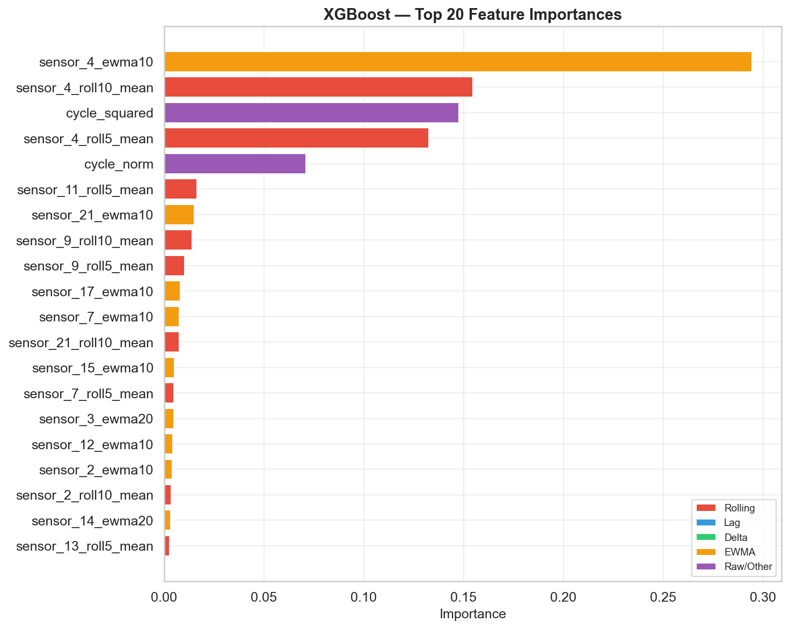

# TurboFault

[](https://github.com/pgrady1322/turbofault/actions/workflows/ci.yml)
[](https://www.python.org/downloads/)
[](LICENSE)

**Multimodal Time-Series Anomaly Detection & Remaining Useful Life Prediction**

Predict turbofan engine failure using the NASA C-MAPSS dataset — fusing 21 sensor channels + 3 operational settings through XGBoost baselines, LSTM, Transformer encoders, and 1D-CNNs.

---

## Why This Project

This project is a proof-of-concept for liftover of genomics engineering and machine learning concepts to other data science applications. Code is pulled from my genomics repositories for the following applications:

| Skill | Source | Application Here |
|-------|--------|------------------|
| Sensor fusion | [immunomics](https://github.com/pgrady1322/immunomics) (multi-omics integration) | 21-channel sensor → unified degradation signal |
| Temporal modeling | [scRN_AI](https://github.com/pgrady1322/scRN_AI) (trajectory inference) | LSTM/Transformer sequence windows |
| Feature engineering | [graphfraud](https://github.com/pgrady1322/graphfraud) (Elliptic features) | Rolling stats, lag features, EWMA |
| Tabular baselines | [Strandweaver](https://github.com/pgrady1322/strandweaver) (XGBoost training) | XGBoost / RF / Ridge baselines |
| Attention mechanisms | [Strandweaver](https://github.com/pgrady1322/strandweaver) (GAT2Conv attention network) | Multi-head self-attention over sensor sequences |

---

## Dataset

The [NASA C-MAPSS Turbofan Engine Degradation Simulation](https://ti.arc.nasa.gov/tech/dash/groups/pcoe/prognostic-data-repository/) contains run-to-failure data for turbofan engines:

| Subset | Train Engines | Test Engines | Op. Conditions | Fault Modes |
|--------|--------------|--------------|----------------|-------------|
| FD001  | 100          | 100          | 1 (sea level)  | 1 (HPC)     |
| FD002  | 260          | 259          | 6              | 1 (HPC)     |
| FD003  | 100          | 100          | 1 (sea level)  | 2 (HPC+Fan) |
| FD004  | 249          | 248          | 6              | 2 (HPC+Fan) |

Each engine records **3 operational settings** and **21 sensor channels** per cycle until failure.

---

## Models

| Model | Type | Key Strength |
|-------|------|-------------|
| **XGBoost** | Tabular | Strong baseline on engineered features |
| **Random Forest** | Tabular | Ensemble robustness |
| **Ridge** | Tabular | Linear baseline reference |
| **LSTM** | Recurrent | Long-range temporal dependencies |
| **GRU** | Recurrent | Lighter LSTM alternative |
| **Transformer** | Attention | Multi-head sensor attention |
| **1D-CNN** | Convolutional | Local temporal pattern detection |

---

## Selected Results / Figures Generated

Although this is directly applied to the NASA CMAPSS Jet Engine sensor degradation dataset, it is also applicable to similar sensor degradation or RUL (remaining useful life) datasets.

### XGBoost — Top 20 Feature Importances

Engineered features (rolling statistics, lag values, deltas, EWMA) dominate over raw sensor readings, validating the feature engineering pipeline.



### Sensor Outlier Analysis

IQR-based outlier detection across the 14 active sensors. In prognostics data, "outliers" near end-of-life are actually the degradation signal — they carry the most predictive information and should **not** be removed.


---

## Quick Start

### Installation

```bash
# Core (XGBoost + sklearn baselines)
pip install -e .

# With deep learning models (PyTorch)
pip install -e ".[deep]"

# Full development environment
pip install -e ".[all]"
```

### Download Data

```bash
turbofault download -o data
```

### Train a Model

```bash
# XGBoost baseline
turbofault train -m xgboost -s FD001 -c configs/xgboost_baseline.yaml

# LSTM
turbofault train -m lstm -s FD001 -c configs/lstm.yaml --epochs 100

# Transformer
turbofault train -m transformer -s FD001 -c configs/transformer.yaml
```

### Evaluate on Test Set

```bash
# Evaluate a tabular model (trains + evaluates)
turbofault evaluate -m xgboost -s FD001 -c configs/xgboost_baseline.yaml

# Evaluate a saved deep model
turbofault evaluate -m lstm -s FD001 --model-path trained_models/lstm_FD001.pt
```

### Hyperparameter Tuning

```bash
turbofault tune -m xgboost -s FD001 -n 100
turbofault tune -m lstm -s FD001 -n 50
```

### Explainability

```bash
# Permutation importance (model-agnostic)
turbofault explain -m xgboost -s FD001 --method permutation --top-n 20

# SHAP values (requires: pip install shap)
turbofault explain -m xgboost -s FD001 --method shap
```

---

## Feature Engineering

| Feature Type | Description | Count |
|-------------|-------------|-------|
| Raw sensors | Original 21 sensor readings | 21 |
| Rolling stats | Mean, std over windows (5, 10, 20) | 126 |
| Lag features | Shifted values (1, 3, 5 cycles) | 63 |
| Delta features | Rate-of-change (1, 5 periods) | 42 |
| EWMA | Exponential weighted moving average | 42 |
| Cycle position | Normalized cycle + quadratic term | 2 |

---

## Evaluation Metrics

- **RMSE** — Root Mean Squared Error
- **MAE** — Mean Absolute Error
- **R²** — Coefficient of determination
- **NASA Score** — Asymmetric scoring function (penalizes late predictions more heavily)

The NASA scoring function:
- Early prediction (d > 0): $s = e^{d/10} - 1$
- Late prediction (d < 0): $s = e^{-d/13} - 1$

---

## Explainability

| Method | Scope | Description |
|--------|-------|-------------|
| **Permutation Importance** | Model-agnostic | Shuffle each feature, measure RMSE increase |
| **SHAP** | Tree models | Shapley Additive Explanations via `shap.TreeExplainer` |
| **Sensor Contribution** | Any | Aggregate importance by physical sensor channel |
| **Feature Type Breakdown** | Any | Compare rolling vs. lag vs. delta vs. EWMA contributions |
| **Attention Weights** | Transformer | Extract multi-head self-attention over sensor timesteps |

---

## Project Structure

```
turbofault/
├── turbofault/
│   ├── __init__.py
│   ├── cli.py                  # Click CLI (download, train, evaluate, tune, explain)
│   ├── data/
│   │   ├── dataset.py          # C-MAPSS loader + RUL computation
│   │   ├── features.py         # Rolling, lag, delta, EWMA features
│   │   └── preprocessing.py    # Normalization, windowing, splits
│   ├── models/
│   │   ├── xgboost_baseline.py # XGBoost, Random Forest, Ridge
│   │   ├── lstm.py             # LSTM + GRU models
│   │   ├── transformer.py      # Transformer encoder
│   │   └── cnn1d.py            # 1D-CNN model
│   ├── training/
│   │   ├── trainer.py          # Training loops (tabular + deep)
│   │   ├── evaluation.py       # RMSE, MAE, R², NASA Score
│   │   └── hp_search.py        # Optuna hyperparameter search
│   ├── explain/
│   │   └── feature_explainer.py # Permutation, SHAP, sensor attribution
│   └── visualization/
│       └── plots.py            # Sensor traces, RUL plots, comparisons
├── configs/                    # YAML model configurations
├── tests/                      # pytest test suite (77 tests)
├── notebooks/                  # EDA and analysis notebooks
├── .github/workflows/ci.yml    # GitHub Actions CI/CD
└── pyproject.toml              # PEP 517/518 build config
```

---

## Development

```bash
# Install dev dependencies
pip install -e ".[dev]"

# Run tests
pytest tests/ -v

# Lint
ruff check turbofault/ tests/

# Format
black turbofault/ tests/
```

---

## License

MIT License — see [LICENSE](LICENSE) for details.
